# Aplikacje internetowe
Strona stworzona za pomocą poradnika :
https://tutorial.djangogirls.org/pl/
 
Link do strony :
http://palubickikamil.pythonanywhere.com/
 
## Laboratorium 1 Blog uruchomiony na PaaS (Django+PythonAnywhere)

### Strona składa się z strony głównej z możliwością dodania postu(jedynie przez zalogowanego administratora):
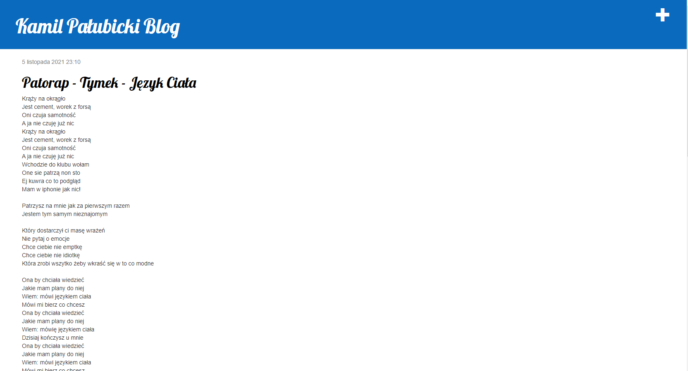
### Strona postu:
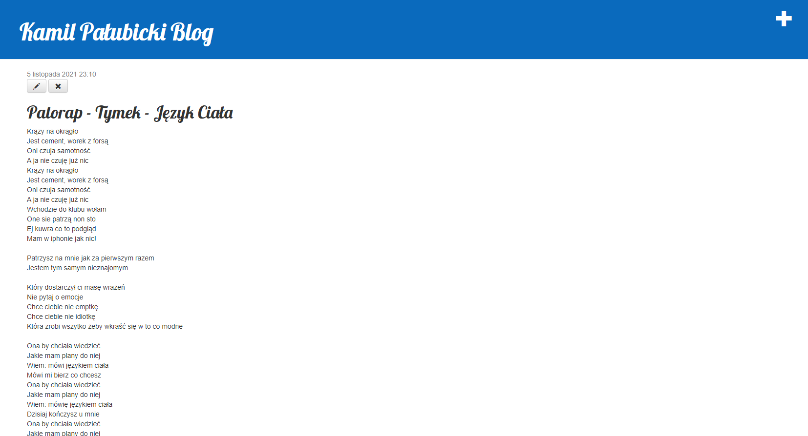
### Możliwość edycji oraz usunięcia posta
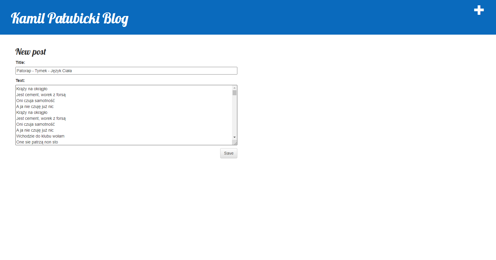

## Laboratorium 2 Rejestracja użytkowników (Django+Heroku)
Link do strony :
https://palubickikamil.herokuapp.com/
 

### Pierwsza zmianą było przejście na heroku z powodu problemów z wysyłaniem maili. Dodałem również na początku możliwość rejestracji, zalogowania oraz resetu hasła.

### Rejestracja nowego użytkownika:
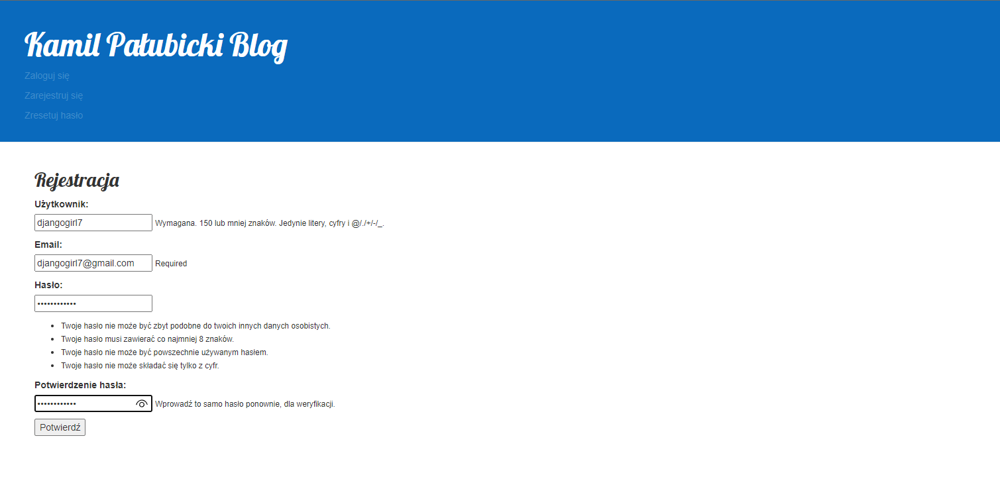
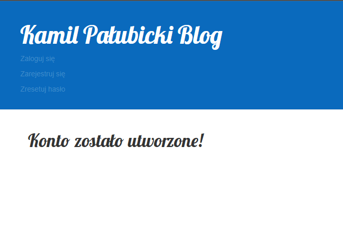
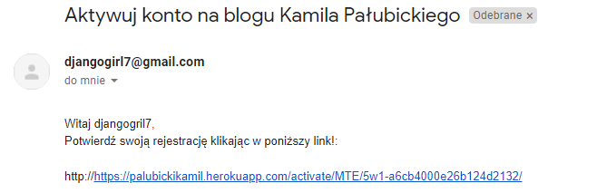
### Możliwość zalogowania się po aktywacji

### Opcja zmiany hasła będąc zalogowanym:
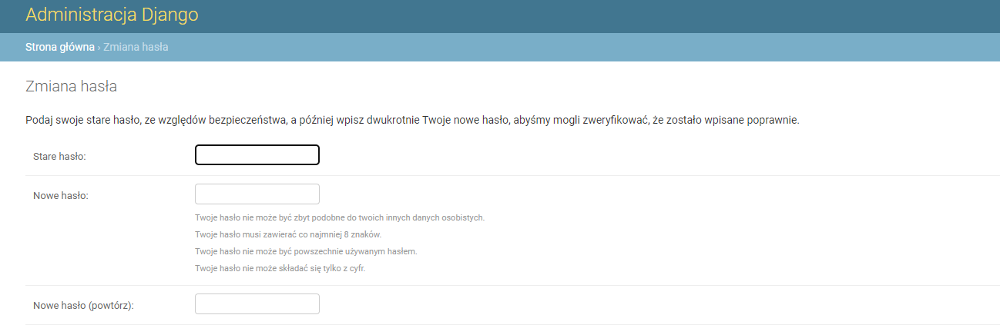
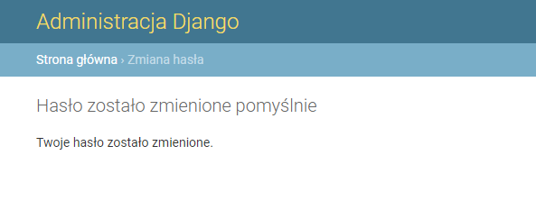
### Możliwość resetu hasła:
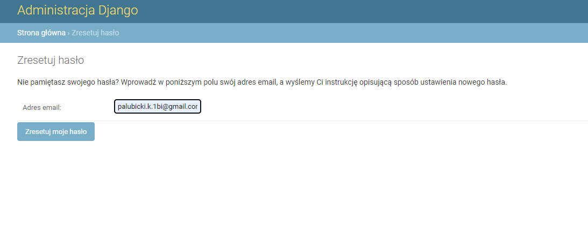
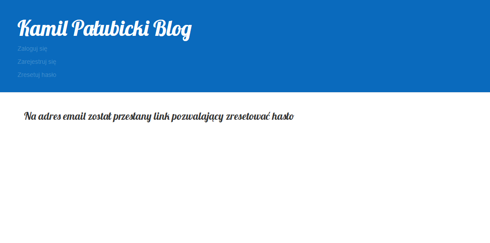

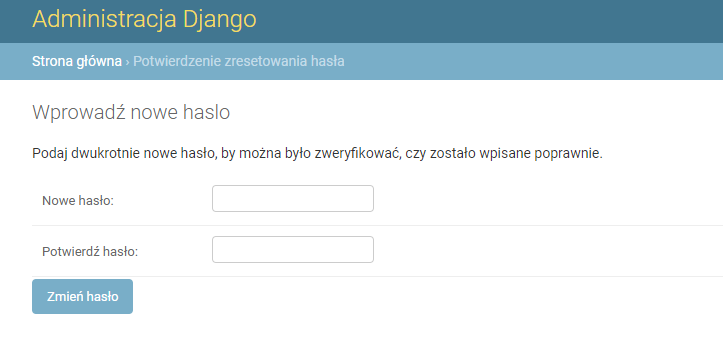
### Użytkownik od razu po wprowadzeniu nowego hasła jest w stanie zalogować się na swoje konto

## Laboratorium 3 Różne sposoby uwierzytelniania (Django+Heroku)

### Od teraz jest możliwość również uwierzytelniania za pomocą facebook'a, Google i Github.
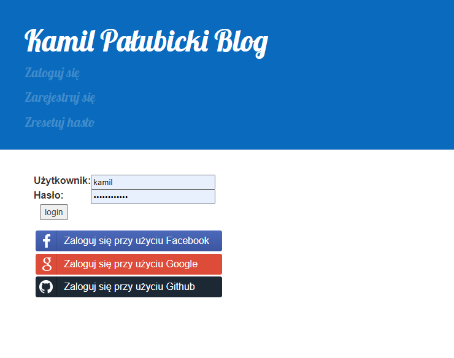

### Facebook:
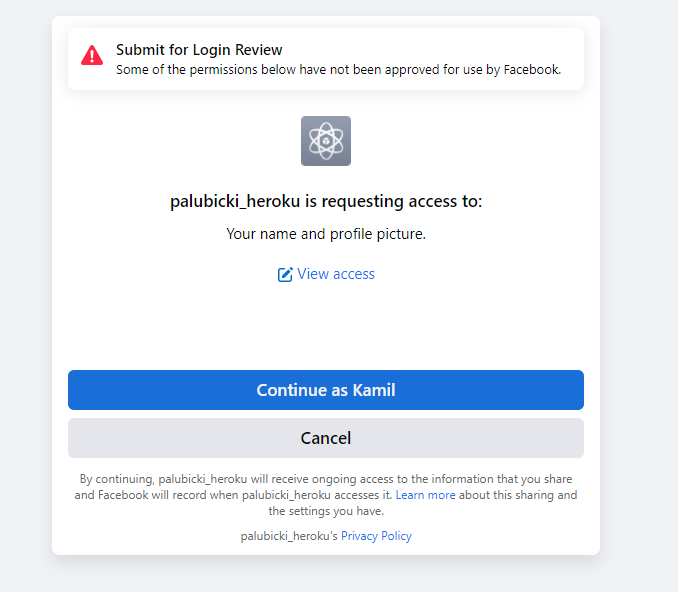
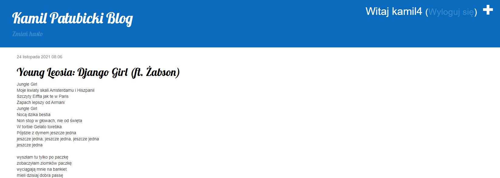

### Google:
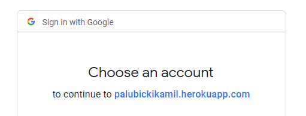
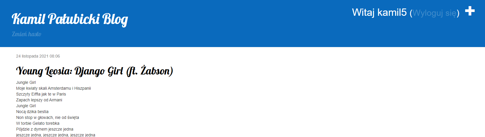

### Github:
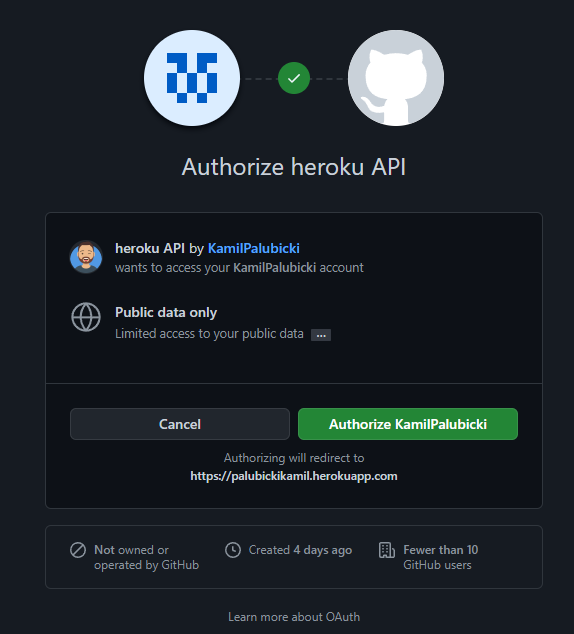
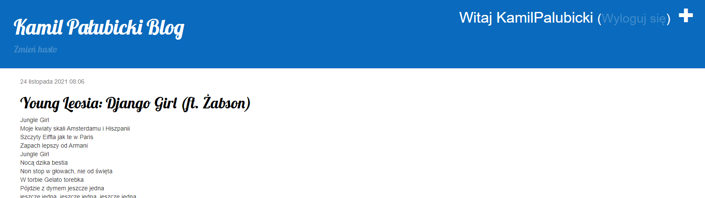

### Możemy teraz w panelu admina zobaczyć wszystkie konta społecznościowe utworzone poprzez autoryzacje za pomocą wcześniej pokazanych aplikacji
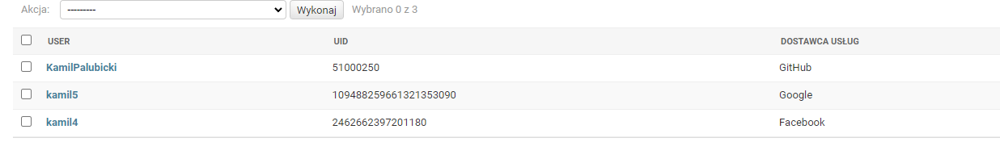