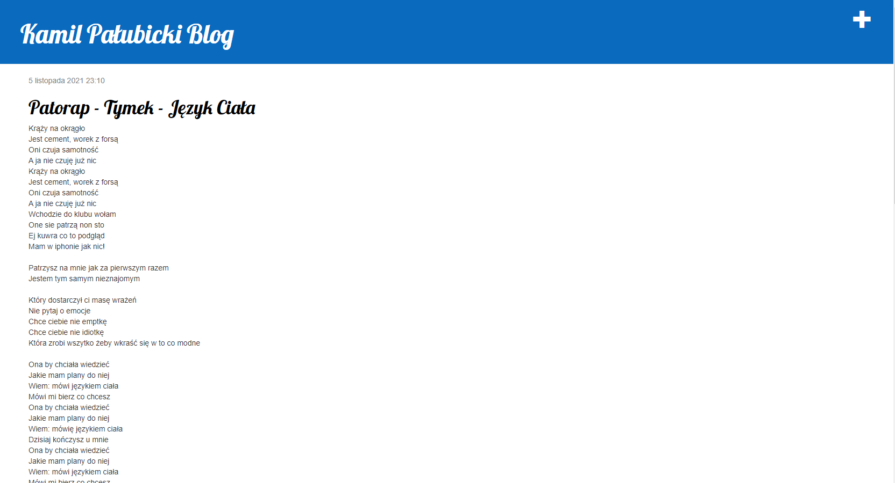
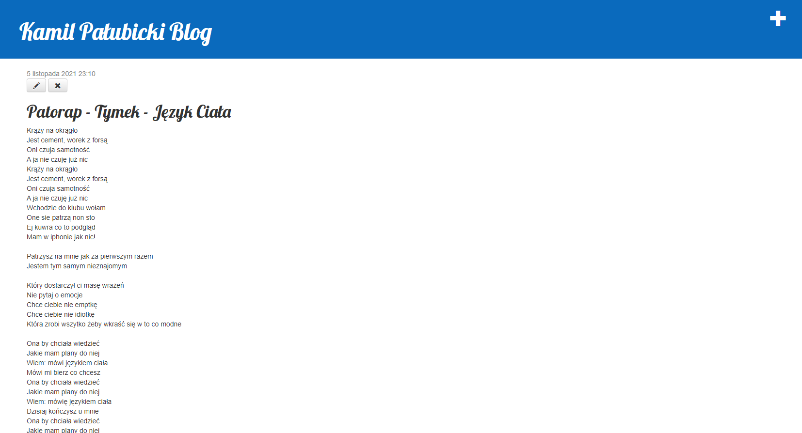
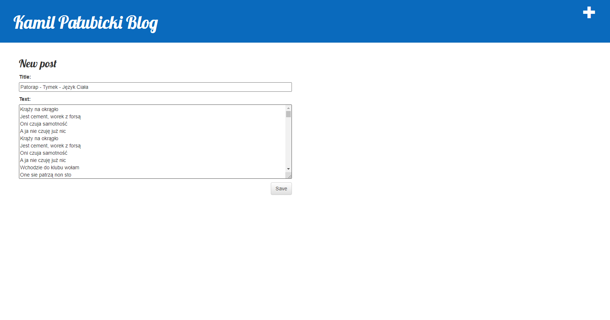

# Laboratorium 1 Python(Django+PythonAnywhere)
Strona stworzona za pomocą poradnika :
https://tutorial.djangogirls.org/pl/
 
Link do strony :
http://palubickikamil.pythonanywhere.com/
 
## Strona składa się z strony głównej z możliwością dodania postu(jedynie przez zalogowanego administratora):

## Strona postu:

## Możliwość edycji oraz usunięcia posta

