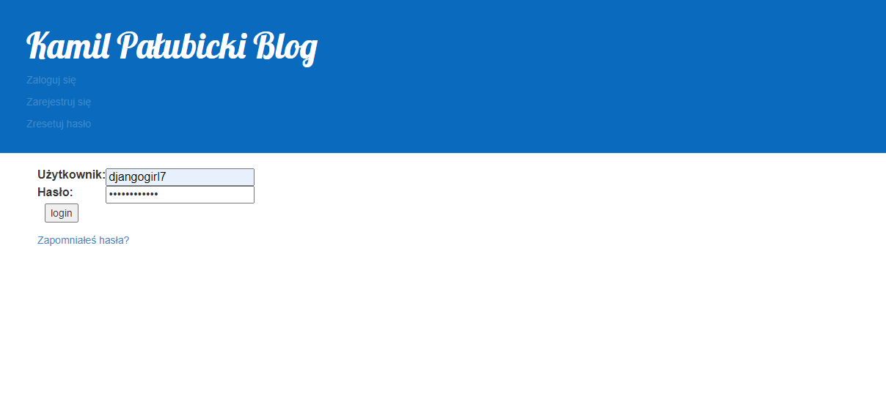
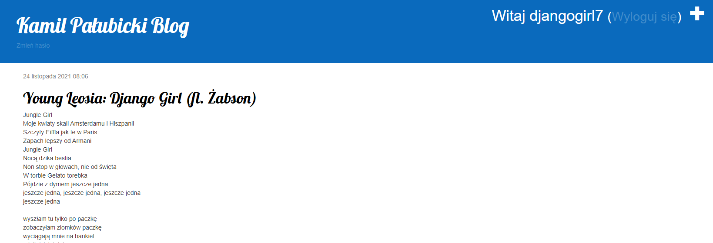
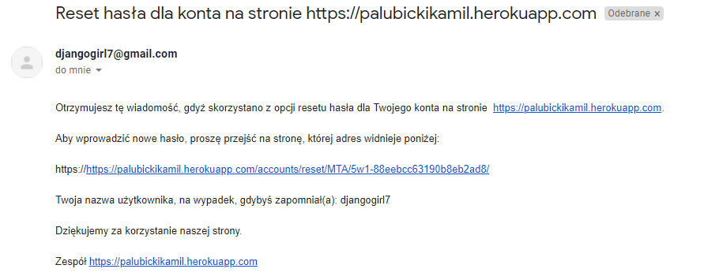

# Aplikacje internetowe
Strona stworzona za pomocą poradnika :
https://tutorial.djangogirls.org/pl/
 
Link do strony :
http://palubickikamil.pythonanywhere.com/
 
## Laboratorium 1 Blog uruchomiony na PaaS (Django+PythonAnywhere)

### Strona składa się z strony głównej z możliwością dodania postu(jedynie przez zalogowanego administratora):

### Strona postu:

### Możliwość edycji oraz usunięcia posta

## Laboratorium 2 Rejestracja użytkowników (Django+Heroku)
 
Link do strony :
https://palubickikamil.herokuapp.com/
 

### Pierwsza zmianą było przejście na heroku z powodu problemów z wysyłaniem maili. Dodałem również na początku możliwość rejestracji, zalogowania oraz resetu hasła.

### Rejestracja nowego użytkownika:

### Możliwość zalogowania się po aktywacji

### Opcja zmiany hasła będąc zalogowanym:

### Możliwość resetu hasła:

### Użytkownik od razu po wprowadzeniu nowego hasła jest w stanie zalogować się na swoje konto