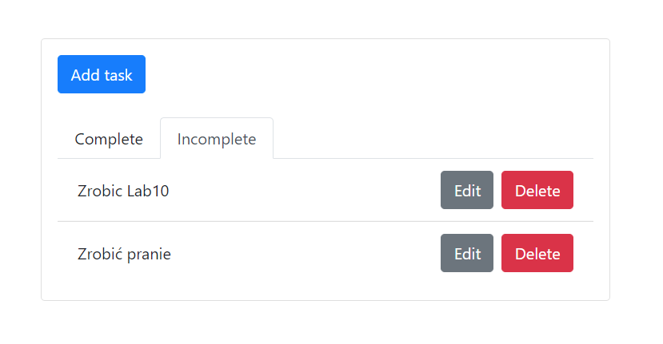
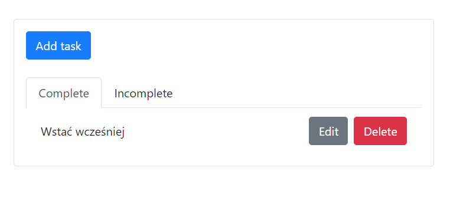
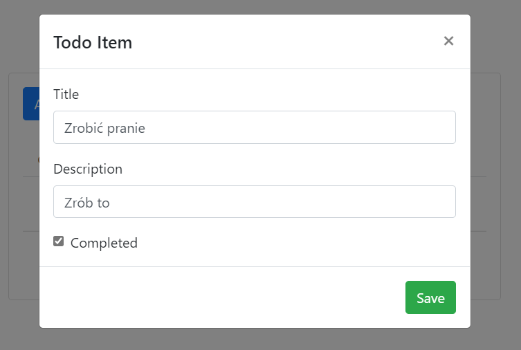
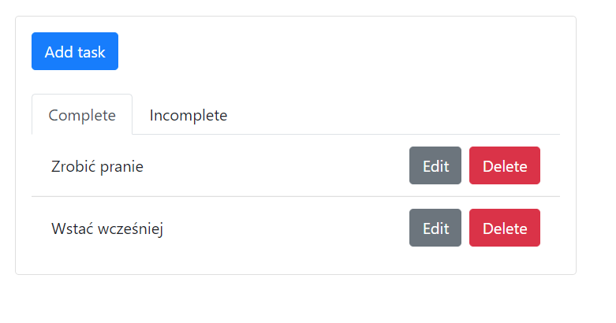
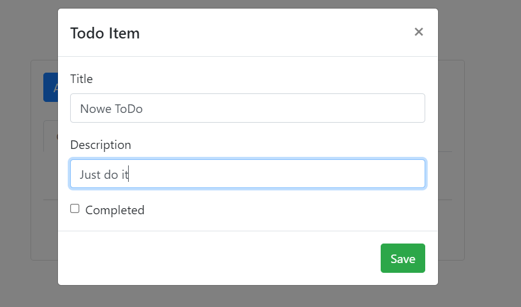
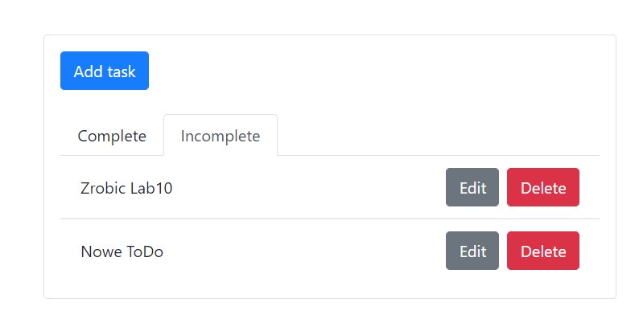
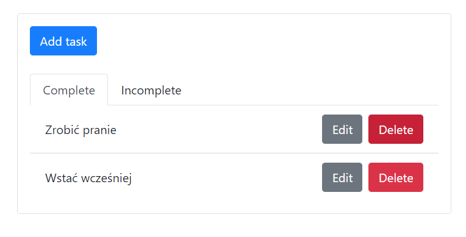
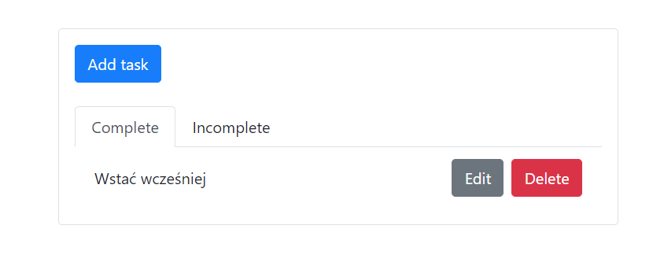

# Laboratorium nr.10 Django + React (aplikacja typu ToDo)

### Strona wykonana na podstawie przykładu aplikacji <a href="https://www.digitalocean.com/community/tutorials/build-a-to-do-application-using-django-and-react" rel="nofollow">TO-DO</a>

## Wykorzystane technologie:
<ul>
    <li>React</li>
    <li>axios</li>
    <li>reactstrap</li>
    <li>Django</li>
    <li>Django Rest Framework</li>
    <li>django-cors-headers</li>
    <li>react-router</li>
</ul>

### Przykładowy wygląd strony
#### Zadania niewykonane

#### Zadania wykonane

### Edytowanie

#### Po edycji

### Widok dodawania zadania

#### Po dodaniu:

### Usuwanie
#### Przed

#### Po

## Zmiany
### :TODO: