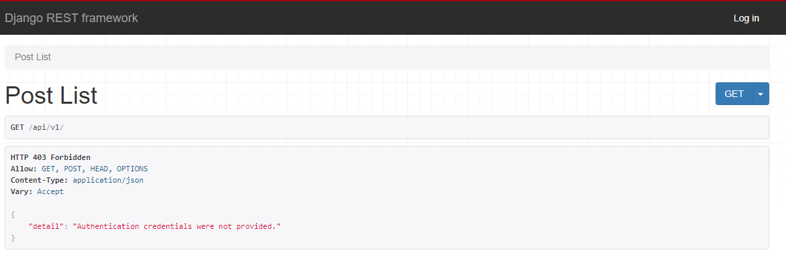
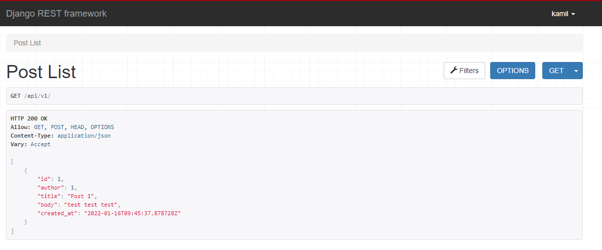
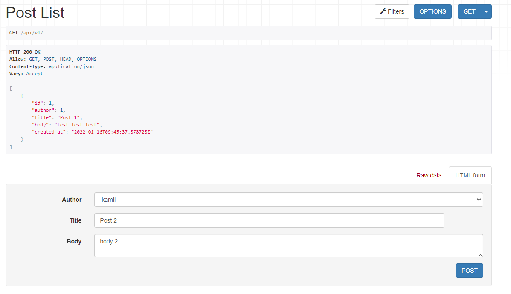
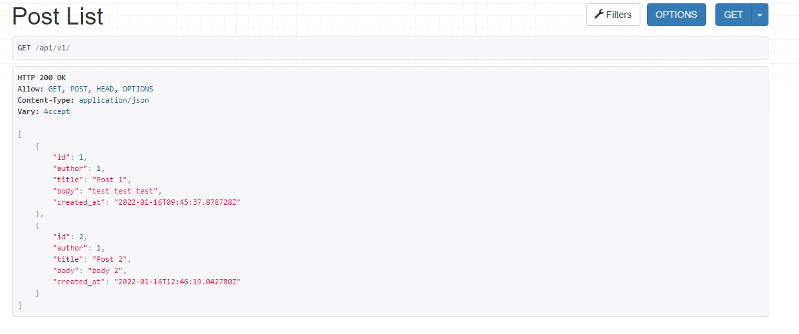
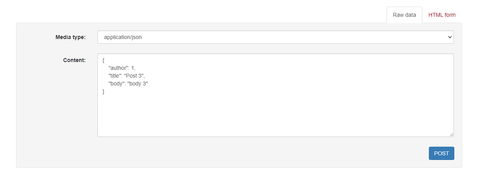
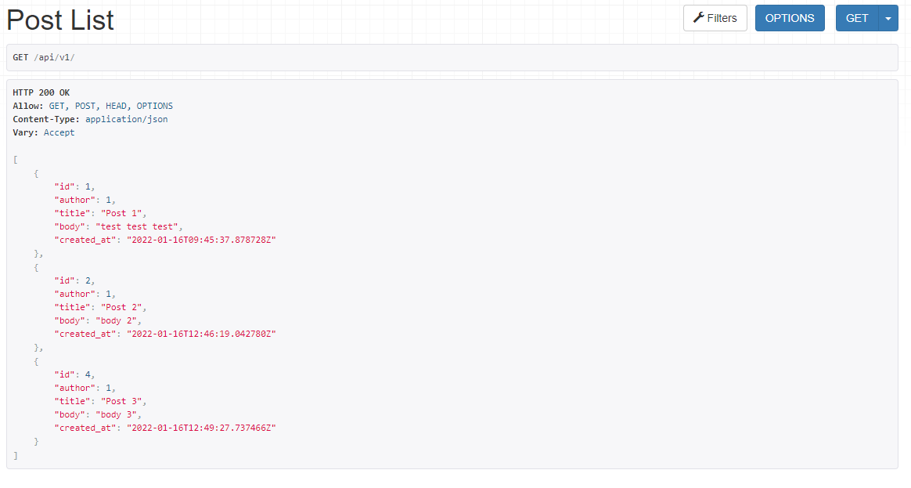
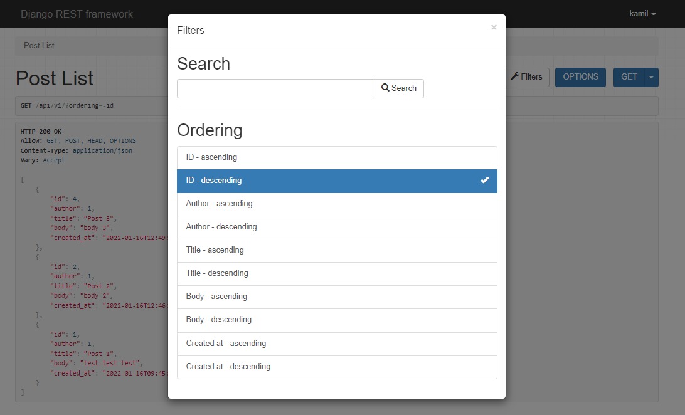
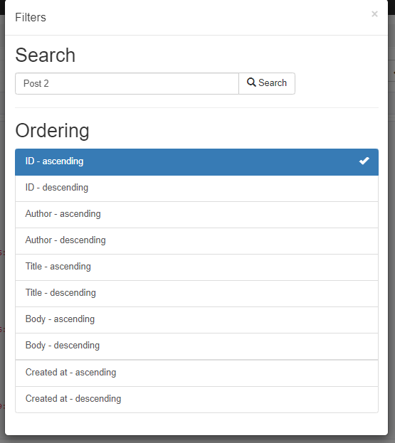
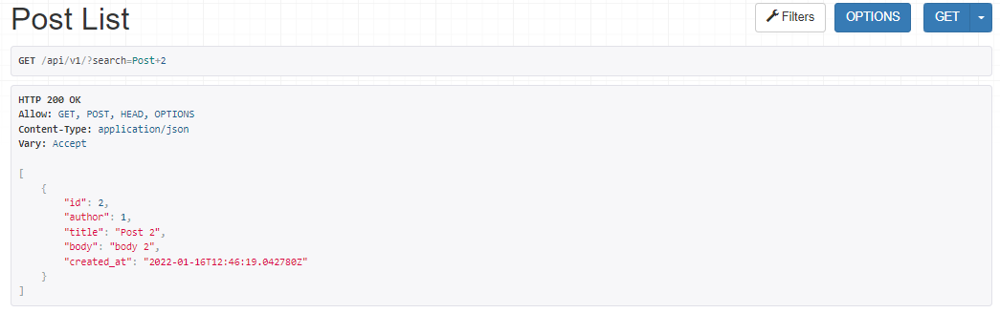
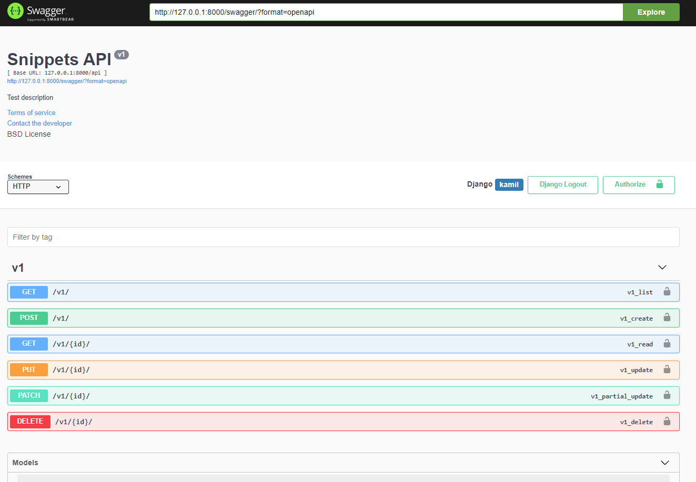

## Laboratorium 4 REST API z DRF

#### W celu sprawdzenia działania połaczenia djanog z naszym API stworzyłem przykładowy post za pomocą panelu admina.
## Post list
#### Po przejściu do panelu REST ( api/v1 ) będąc nie zalogowanym możemy zobaczyć komunikat o braku autoryzacji:

#### Po zalogowaniu jako superuser:

## Post list - dodawanie i filtrowanie postów
#### Możliwość dodania postu poprzez panel - HTML Form

#### Post widoczny po dodaniu

#### Możemy również dodawać posty poprzez bezpośrednie wpisywanie danych w formie json

#### Filtrowanie postów 

#### Możemy też wyszukać post korzystając z 'search bar'

## Swagger

