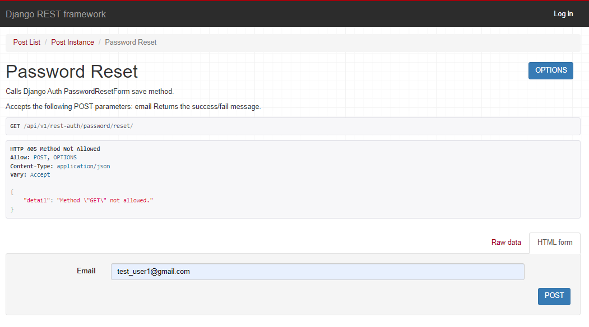

## Laboratorium 6 Zezwolenia i uwierzytelnianie w DRF

#### Przy pomocy Django-rest-auth stworzyłem widoki logowania, wylogowywania, rejestracji oraz zmiany hasła
## Rejestracja użytkownika i otrzymanie tokenu
#### Utworzony token będzie potrzebny do uwierzytelniania poprzez niego

#### Treść maila po utworzeniu konta

## Logowanie za pomocą sesji
#### Po odświeżeniu strony jesteśmy zalogowani na utworzone konto na podstawie sesji

## Logowanie za pomocą tokenu

## Logowanie klasyczne

## Wylogowanie

## Zmiana hasła

## Potwierdzenie zmiany hasła

## Tokeny

## Cookies

