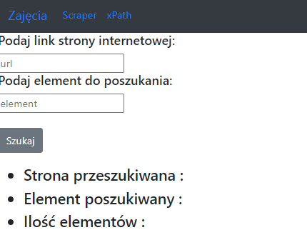

# Laboratorium nr.5
## Web Scraping - Przykłady z zajęć
### Przykład 1

#### Strona źródłowa - 7 paragraf

#### Ilość elementów 

### Przykład 2

### Przykład 3

### Przykład 4

## Web Scraping - formularz
### Scraper

### Strona źródłowa

### Wynik wyszukiwania

## Web Scraping - xPath

### Wyszukiwanie przy pomocy klasy

### Wyszukiwanie przy pomocy xPath

