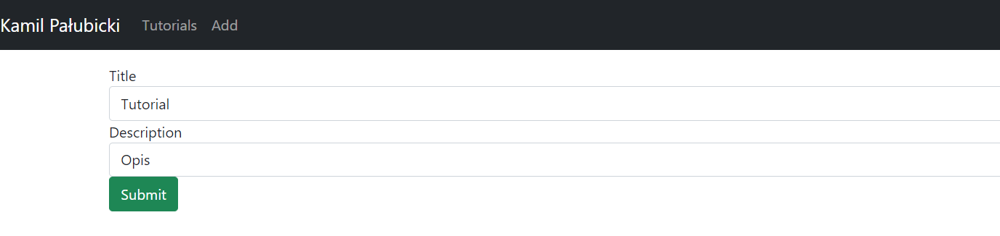

# Laboratorium nr.9 Django + React (aplikacja CRUD)

### Strona wykonana na podstawie przykładu aplikacji <a href="https://bezkoder.com/django-react-axios-rest-framework/" rel="nofollow">CRUD</a></h1>

## Wykorzystane technologie:
<ul>
    <li>React</li>
    <li>react-router-dom</li>
    <li>axios</li>
    <li>bootstrap</li>
    <li>Django</li>
    <li>Django Rest Framework</li>
    <li>django-cors-headers</li>
    <li>react-router</li>
</ul>

### Przykładowy wygląd strony


### Czysty układ strony
#### Po naciśnięciu 'Remove All' usuwamy wszystkie dodane tutoriale


### Widok dodawania tutorialu

#### Po dodaniu:


### Wyszukiwanie
#### Przed

#### Po


## Zmiany

### Backend
#### settings.py
``` python

    CORS_ORIGIN_ALLOW_ALL = False
    CORS_ALLOWED_ORIGINS = [
        "http://localhost:3000"
    ]

    REST_FRAMEWORK = {
        'DEFAULT_PERMISSION_CLASSES': [
        'rest_framework.permissions.AllowAny',
    ]
    }

    CORS_ORIGIN_WHITELIST = (
        'http://localhost:8000',
    )

```
#### views.py
``` python

    from django.http.response import JsonResponse
    from rest_framework.parsers import JSONParser
    from rest_framework import status
    from tutorials.models import Tutorial
    from tutorials.serializers import TutorialSerializer
    from rest_framework.decorators import api_view


    @api_view(['GET', 'POST', 'DELETE'])
    def tutorial_list(request):
        if request.method == 'GET':
            tutorials = Tutorial.objects.all()

        title = request.query_params.get('title', None)
        if title is not None:
            tutorials = tutorials.filter(title__icontains=title)

        tutorials_serializer = TutorialSerializer(tutorials, many=True)
        return JsonResponse(tutorials_serializer.data, safe=False)
        # 'safe=False' for objects serialization

    elif request.method == 'POST':
        tutorial_data = JSONParser().parse(request)
        tutorial_serializer = TutorialSerializer(data=tutorial_data)
        if tutorial_serializer.is_valid():
            tutorial_serializer.save()
            return JsonResponse(tutorial_serializer.data, status=status.HTTP_201_CREATED)
        return JsonResponse(tutorial_serializer.errors, status=status.HTTP_400_BAD_REQUEST)

    elif request.method == 'DELETE':
        count = Tutorial.objects.all().delete()
        return JsonResponse({'message': '{} Tutorials were deleted successfully!'.format(count[0])},
                            status=status.HTTP_204_NO_CONTENT)


    @api_view(['GET', 'PUT', 'DELETE'])
    def tutorial_detail(request, pk):
        try:
            tutorial = Tutorial.objects.get(pk=pk)
        except Tutorial.DoesNotExist:
            return JsonResponse({'message': 'The tutorial does not exist'}, status=status.HTTP_404_NOT_FOUND)

        if request.method == 'GET':
            tutorial_serializer = TutorialSerializer(tutorial)
            return JsonResponse(tutorial_serializer.data)

        elif request.method == 'PUT':
            tutorial_data = JSONParser().parse(request)
            tutorial_serializer = TutorialSerializer(tutorial, data=tutorial_data)
            if tutorial_serializer.is_valid():
                tutorial_serializer.save()
                return JsonResponse(tutorial_serializer.data)
            return JsonResponse(tutorial_serializer.errors, status=status.HTTP_400_BAD_REQUEST)

        elif request.method == 'DELETE':
            tutorial.delete()
            return JsonResponse({'message': 'Tutorial was deleted successfully!'}, status=status.HTTP_204_NO_CONTENT)


    @api_view(['GET'])
    def tutorial_list_published(request):
        tutorials = Tutorial.objects.filter(published=True)

        if request.method == 'GET':
            tutorials_serializer = TutorialSerializer(tutorials, many=True)
            return JsonResponse(tutorials_serializer.data, safe=False)
```